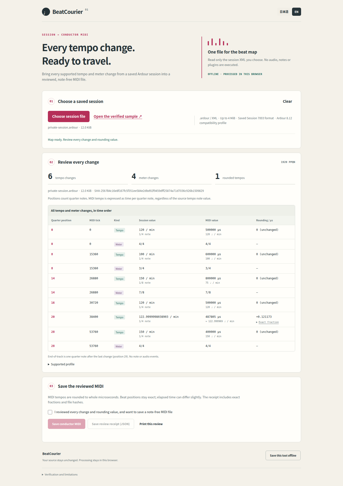

# BeatCourier

BeatCourier turns supported stepped tempo and meter changes in a saved Ardour session into a note-free conductor MIDI file. It runs offline in your browser and leaves the original session unchanged.

Open [the standalone HTML](dist/beat-courier.html), choose one saved `.ardour` file, review every change and rounding value, then save the MIDI and its JSON receipt. The interface supports Japanese and English, keyboard controls, cancellation, printable review and a clean offline copy of the tool.

## Supported profile

- UTF-8 Session version 7003 XML, up to 4 MiB, with the verified Ardour clock rate
- Complete stepped tempo and meter maps beginning at quarter 0; constant tempos only
- Whole-quarter positions. Tempo changes must also lie on native meter beats, and meter changes must start native bars. Fractional positions such as 15.5 are rejected without moving them
- Empty MusicTimes. BBT resets and native-resaved imported sessions containing terminal import markers are unsupported inputs
- Power-of-two tempo-note values and meter denominators from 1 to 64; meter numerators from 1 to 127; up to 2,048 points of each kind
- Format 0, one conductor track, 1920 PPQN, tempo/time-signature metadata and end-of-track only. No notes or audio

Positions use exact integer/rational arithmetic. Tempo values are converted from their source note unit into microseconds per quarter note and rounded to the nearest integer. The review and receipt expose the exact fraction and error. Beat positions remain exact; elapsed time can differ slightly after tempo rounding.

The inert parser rejects DTD/entity declarations, other processing instructions, namespaces, malformed or ambiguous data and bounded-resource violations. Parsing and hashing run in a Web Worker with an eight-second limit. Replacement, clear and cancellation invalidate pending results and terminate the worker. The tool does not execute a session, plugin or media, scan a workspace, or send input data to a server.

## Why a separate conductor file?

Ardour already exports MIDI. The existing [ArdourMIDIExport](https://github.com/dbolton/ArdourMIDIExport/blob/534f1af45c28696e6cd03b63da99c0732ec2fbf0/README.md) approach combines MIDI tracks and documents an initial-tempo/meter limitation. BeatCourier's modest difference is collecting every supported saved-map change into a separate conductor file. It is not a general replacement for native MIDI export or a universal DAW compatibility claim.

## Verified behavior

The actual browser download passed the unchanged production importer in official Debian 13 Ardour **1:8.12.0+ds-1**, followed by native save and fresh-process reload. The test uses original synthetic sessions, a Dummy backend and the native Scripting interface to invoke `PublicEditor::do_import` with the real file. It does not replace the importer, rewrite the resulting session map, or claim to exercise the import dialog's buttons.

- 39 sandboxed browser cases, including actual downloads, same-file reselection, delayed reads, stale real-worker results, cancellation, timeout, errors and offline privacy
- Japanese/English desktop and 390 px / 320 px viewport reviews, horizontal table access, and complete one-page print reviews
- Eight native cases and 120 literal map readings for the actual browser MIDI: positive import/reload plus exact tempo, meter and shifted-event faults
- Every saved tempo/meter position, clock and BBT coordinate; exact 106-byte fixture MIDI and all 10 receipt entries; unchanged source bytes

See [the release verification record](docs/RELEASE.md), [browser report](docs/evidence/browser/browser-report.json), [native report](docs/evidence/native/full-native-report.json), and [evidence provenance](docs/evidence/provenance.json). Runtime evidence comes from [the accepted browser/native run](https://github.com/Masanori-Spec/beat-courier/actions/runs/37610052361), with separate [production-core](https://github.com/Masanori-Spec/beat-courier/actions/runs/37610052160) and [compatibility-probe](https://github.com/Masanori-Spec/beat-courier/actions/runs/37610052181) runs.

The executed native profile is Ardour 8.12, not 9.2. Native exact-boundary lookup and terminal-marker normalization are documented in the gate contracts. Successful native logs retain nonfatal GTK/GObject diagnostics around closure; normal exit 0 is proven, not error-free logs. Browser viewport tests are not physical-device tests.

## Development

Run `npm ci --ignore-scripts`, then `npm run verify` for the pure tests and reproducible standalone build. Hosted workflows run the real sandboxed browser and pinned native consumer. See the [production gate](docs/production-gate.md), [browser gate](docs/browser-gate.md), and [original compatibility probe](docs/native-contract.md).

No license grant is made for original BeatCourier code or fixtures. The bundled XML dependency's license is retained in [third-party notices](THIRD_PARTY_NOTICES.txt). Public source contains no Ardour binary or package archive.
